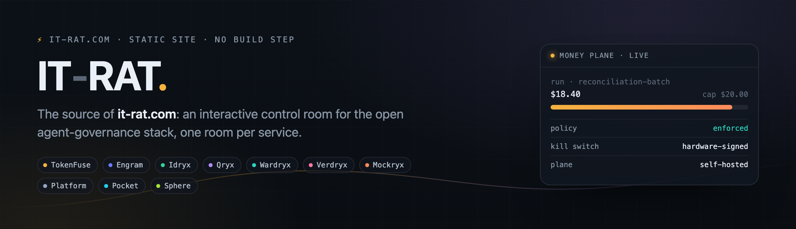

<p align="center">
  
</p>

<p align="center">
  <a href="https://it-rat.com"></a>
  <a href="https://github.com/it-rat/it-rat.github.io/actions/workflows/pages.yml"></a>
  
  
  <a href="https://github.com/TAIPANBOX"></a>
</p>

# it-rat.com

The source of **[it-rat.com](https://it-rat.com)**: a product site for the TAIPANBOX agent-governance
stack, built as an interactive control room rather than a brochure. Every service gets its own room
with a scrubbable simulation of how it behaves over time, an animated architecture diagram, and an
honest comparison against the alternatives we rejected.

The stack itself is **defensive**: it exists so the owner of an AI-agent fleet can see, price, govern
and stop their own agents. Nothing here is offensive tooling, and the site is written to say so.

## The rooms

| Page | Plane | What it covers |
|---|---|---|
| `index.html` | the stack | The home control room: fuse-wire hero, the service rail, the wiring diagram, live-validation numbers |
| `services/tokenfuse.html` | money | Runtime spend control, budgets, the kill switch |
| `services/engram.html` | memory | The SQLite of agent memory, single file, embeddable |
| `services/wardryx.html` | policy | Policy decisions with a human in the loop |
| `services/idryx.html` | access | One identity graph for humans, keys and agents |
| `services/qryx.html` | crypto | Cryptography inventory and post-quantum risk |
| `services/verdryx.html` | quality | Cost per correctly resolved case, not per token |
| `services/mockryx.html` | pre-prod | Fire drills that prove guardrails hold |
| `services/platform.html` | contract | Agent Passport, the shared event envelope, Terraform |
| `services/pocket.html` | iOS, watchOS | TokenFuse Pocket, the pager and the kill from the wrist |
| `services/sphere.html` | iOS | Sphere, twelve life-sphere agents |
| `enterprise.html` | control room | Genaryx, the paid browser console on your own box. In the works, no pricing |

## How it deploys

Push to `master`. That is the whole procedure.

[`.github/workflows/pages.yml`](.github/workflows/pages.yml) checks out the tree, runs one cheap
gate, and publishes. The gate walks every local `src`/`href` in the HTML pages and fails the run if a
reference does not resolve, because this repo has shipped both a page pointing at a deleted
screenshot and orphaned images left publicly reachable.

Pages is set to **GitHub Actions** as its source (since 2026-07-21), not the built-in branch builder,
so a failed publish has a log and a re-run button instead of a silent "Page build failed". The custom
domain lives in `CNAME`, HTTPS is enforced, and `.nojekyll` keeps Pages from reinterpreting the tree.

## Run it locally

```sh
python3 -m http.server 8123 --directory .
```

Then open <http://localhost:8123>. Use http rather than opening the files directly: cross-document
View Transitions do not run on `file://`.

## How it is built

No build step, no CDNs, no external fonts, no trackers. Plain HTML, one stylesheet, a handful of ES
modules, and everything works from any static file server.

- `assets/site.css` is the design system: dark control room, a per-service accent color, view-transition slides.
- `assets/site.js` holds the service registry (id, plane, accent, blurb), the command palette (`Cmd+K` or `/`), directional cross-document View Transitions, reveal-on-scroll, count-up numbers, and arrow-key paging.
- `assets/sim.js` is the timeline engine shared by every service simulation: counters, event log, play, scrub, speed, reduced-motion aware.
- `assets/stages/*.js` is one bespoke stage per service, drawn on that shared timeline: a fuse wire and budget bar for TokenFuse, decision-gate lanes for Wardryx, an estate sweep grid for Qryx, and so on. Each stage is deterministic in `t`, so scrubbing works in both directions.
- `assets/ambient.js` gives each service hero a quiet canvas motif from its own domain: gradient descent, a learned decision boundary, a memory graph with spreading activation, an identity graph, a rotating point lattice, training curves, adversarial bursts against a guardrail.
- `assets/diagram.js` handles the architecture schematics: staggered draw-in on reveal, plus a full-screen lightbox with wheel and pinch zoom, drag pan, and double-click reset, so every label stays readable.
- `assets/shotbox.js` frames and enlarges the product screenshots on the Enterprise page.

## House rules for edits

- **Say only what is true.** Genaryx is not released: the Enterprise page carries an "In the works." ribbon, Pocket an "An exploration." one, and neither shows pricing or a download. Numbers on the site come from the validation records in the stack repos, not from marketing.
- **No long dashes in copy.** Reword, or use a comma, a colon, parentheses, or a short hyphen.
- **Keep it self-contained.** A new dependency that needs a CDN does not belong here.
- **SVG stays legible.** No raster artwork for diagrams, and no label smaller than 10px; anything dense gets the lightbox.
- **Screenshots belong to the site**, not to the documents next to it.

## Related

The stack this site describes lives at **[github.com/TAIPANBOX](https://github.com/TAIPANBOX)**, and
the open services are Apache-2.0: TokenFuse, Engram, Idryx, Qryx, Wardryx, Verdryx, Mockryx, the
Platform contract, and the `stack-up` launcher that runs the whole thing locally with one command.

<sub>&copy; 2026 IT-RAT</sub>
