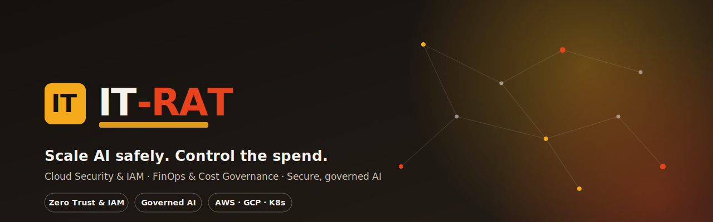
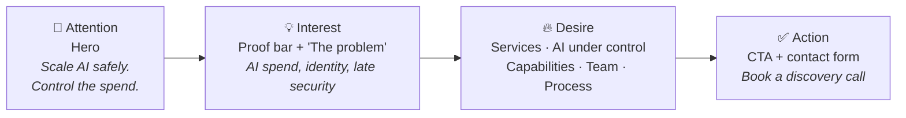
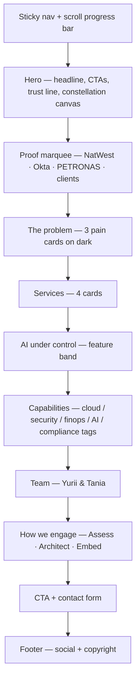
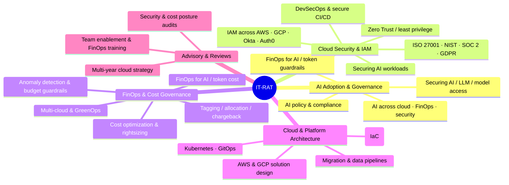
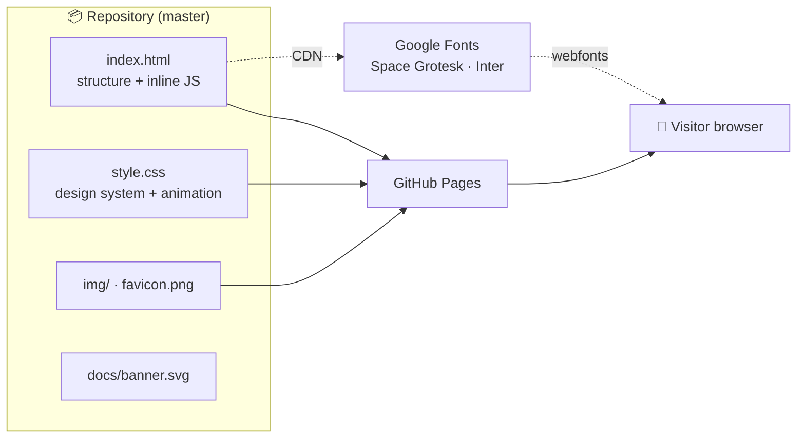

<p align="center">
  
</p>

<p align="center">
  <a href="#-live-site"></a>
  
  
  
  
  
</p>

# IT-RAT

Marketing site for **IT-RAT** — a boutique cloud consultancy. The company is
positioned around two disciplines its founders practise at enterprise scale —
**Cloud Security & IAM** and **FinOps & Cloud Cost Governance** — now applied to
a full-scale **AI rollout**: adopting AI across cloud, FinOps and security while
keeping it secure, cost-governed and compliant.

The site is a single, self-contained landing page: hand-written HTML, CSS and
vanilla JavaScript with **no frameworks, no build step and no runtime
dependencies** beyond Google Fonts. It is hosted on GitHub Pages.

---

## 🌐 Live site

> ## **https://it-rat.github.io/**

Served from the `master` branch of this repository via GitHub Pages.

> [!NOTE]
> **`it-rat/it-rat.github.io` is the canonical repository** — it powers the live
> `it-rat.github.io` site. `TAIPANBOX/it-rat.github.io` is only a personal fork
> used to prepare changes.

---

## 🧭 The message (AIDA)

The page is structured around the classic **A·I·D·A** copywriting funnel — every
section pushes the visitor one step further toward booking a call.



---

## 🗺️ Page structure



---

## 🧩 Services offered



---

## ⚙️ Architecture & tech

A deliberately simple, dependency-free static site — fast, portable and trivial
to host.



| Layer | Choice |
|---|---|
| Markup | Semantic HTML5, single page |
| Styling | One `style.css`, CSS custom properties, grid/flex, `clamp()` |
| Behaviour | Vanilla JS (one IIFE, inline) |
| Graphics | Inline SVG icons + a `<canvas>` particle field |
| Fonts | Space Grotesk (display) + Inter (body) |
| Build | **None** — open `index.html` and it runs |
| Hosting | GitHub Pages |

---

## 🎬 Interactivity & motion

- **Constellation canvas** in the hero — a particle network (amber / red / ink
  nodes) that links nearby points and reacts to the cursor.
- **3D tilt + parallax** on the hero illustration and its floating badges.
- **Magnetic buttons** that lean toward the pointer.
- **Logo marquee** — an infinite, pause-on-hover credibility strip.
- **Scroll-reveal** of every section (staggered) + a top **scroll-progress bar**.
- **Animated backgrounds** — drifting dot-grid, rotating glows on the dark bands.
- Fully respects **`prefers-reduced-motion`**; reveal is **JS-gated** so the page
  is never blank without JavaScript.

---

## 🎨 Design system

**Palette**

| | Token | Hex | Use |
|---|---|---|---|
|  | Amber | `#F4A91B` | Brand / highlights |
|  | Red | `#E8431C` | Accent / CTA hover |
|  | Ink | `#14110F` | Text / dark sections |
|  | Paper | `#F7F3EC` | Background |

**Type** — `Space Grotesk` for headings, `Inter` for body.
**Motif** — hand-drawn line illustrations + a node/identity-graph constellation.

---

## 👥 The team

<table>
  <tr>
    <td align="center" width="50%">
      <br>
      <b>Yurii Kostiuk</b><br>
      Cloud Security &amp; IAM<br>
      <sub>Lead Security Architect, PETRONAS · ex-Okta</sub><br>
      <a href="https://www.linkedin.com/in/yurii-kostiuk-778900ab/">LinkedIn</a>
    </td>
    <td align="center" width="50%">
      <br>
      <b>Tania Fedirko</b><br>
      FinOps &amp; Cost Governance<br>
      <sub>Principal FinOps Architect, NatWest · AWS Community Builder</sub><br>
      <a href="https://www.linkedin.com/in/tania-fedirko-9bb1a5136/">LinkedIn</a>
    </td>
  </tr>
</table>

---

## 🚀 Run locally

No build, no install. Either open the file directly:

```bash
open index.html
```

…or serve it (recommended, so relative paths and fonts behave):

```bash
python3 -m http.server 4599
# then visit http://localhost:4599
```

---

## 📁 Project structure

```
it-rat.github.io/
├── index.html        # the whole page (markup + inline JS)
├── style.css         # design system, layout, animation
├── favicon.png
├── docs/
│   └── banner.svg    # README banner
└── img/              # logo, team illustrations, client logos
```

---

## 🛠️ Deployment

Pushing to `master` publishes automatically through GitHub Pages — no CI, no
actions, no build artefacts.

```bash
git add -A
git commit -m "feat: ..."
git push origin master
```

---

## 📄 License

© IT-RAT. All rights reserved. Team illustrations and logo belong to IT-RAT.
